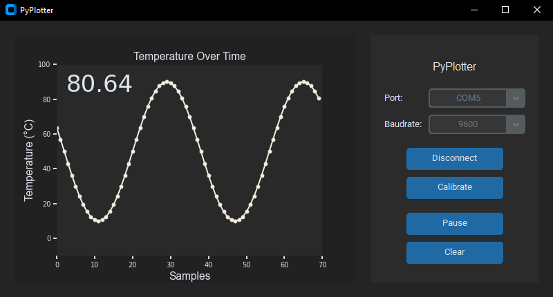

# Python Serial Plotter

PyPlotter is a graphical user interface (GUI) application written in Python that allows to plot data received from a serial port. It is designed to work perfectly with microcontrollers like Arduino, ESP32, or any other device that communicates data via a serial connection.

## Features
- Easy to use interface.
- Real-time plotting of data received from a serial port.
- Customizable plot settings.

## Screenshot


## Installation
Follow these steps to set up the environment and run the GUI application:

1. Clone the repository.
    ```bash
    git clone https://github.com/Sebastian-GA/PyPlotter.git
    ```
2. Create and activate a virtual environment (optional).
    ```bash
    python -m venv venv
    venv\Scripts\activate
    ```
3. Install the required dependencies.
    ```bash
    pip install -r requirements.txt
    ```
4. Customize Plot Settings.
    ```bash
    # Open the file src/constants.py
    # Change the values of the variables in the section "Plot"
    ```
5. Run PyPlotter.
    ```bash
    python src/main.py
    ```

## TO-DO
Here are some additional features and improvements that could be added to improve the application:
- Multiple plots.
- Themes.
- Data logging.
- Settings menu.

## License
This project is licensed under the [MIT License](LICENSE).